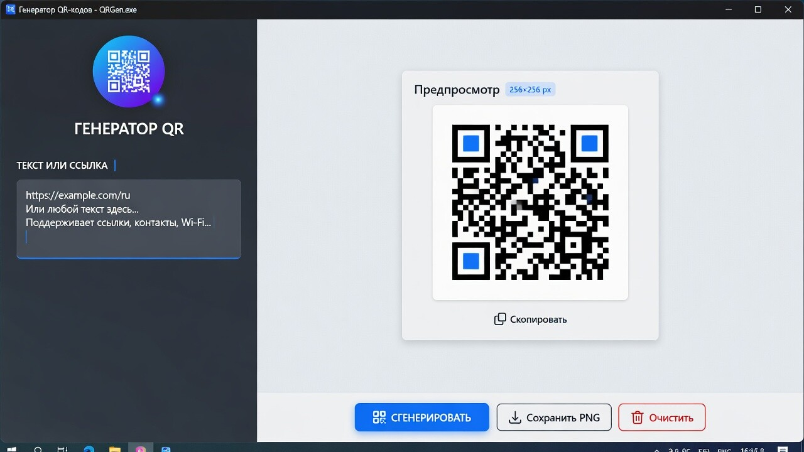

# QR Code Generator

[](LICENSE)

Free and open-source Windows desktop app for generating QR codes from text and URLs.

**Русский:** бесплатное приложение с открытым исходным кодом для Windows — генерация QR-кодов из текста и ссылок.



## Features

- Text or URL input with live preview
- Auto-generation with debounce, manual refresh, and PNG export
- Adaptive error correction for long payloads
- 14 languages: English, German, Russian, Ukrainian, Belarusian, Kazakh, Kyrgyz, Georgian, Armenian, Azerbaijani, Romanian, Tajik, Turkmen, Uzbek
- Optional install to Local AppData, Roaming AppData, or Program Files with Start menu shortcut

## Requirements

- Windows 10/11
- [.NET 10 SDK](https://dotnet.microsoft.com/download) (or compatible)

## Build and run

```bash
git clone https://github.com/Mitroshenkov87/QrCodeGenerator.git
cd QrCodeGenerator
dotnet build
dotnet run --project QrCodeGenerator.csproj
```

## Tests

```bash
dotnet test QrCodeGenerator.Tests/QrCodeGenerator.Tests.csproj
```

## Project layout

| Path | Description |
|------|-------------|
| `MainWindow.xaml` | Main UI |
| `Services/QrCodeService.cs` | QR generation via [QRCoder](https://www.nuget.org/packages/QRCoder) |
| `Services/LocalizationService.cs` | UI language switching |
| `Services/AppInstallService.cs` | Portable install and shortcuts |
| `Properties/Resources.*.resx` | Translations |
| `QrCodeGenerator.Tests/` | Unit tests (xUnit) |

## Install from source

Run the app once from the build output, then use **Install** in the window to copy files and create a Start menu shortcut. The install panel is hidden when `install.ini` is detected in the install folder.

## Contributing

Issues and pull requests are welcome. Please keep changes focused and run tests before submitting.

## License

This project is licensed under the [MIT License](LICENSE).